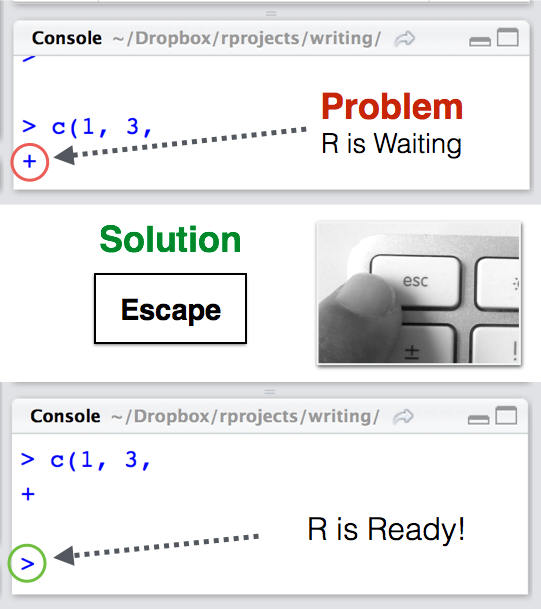

---
output:
  pdf_document: default
  html_document: default
---
# Getting Started {#started}

```{r, echo = FALSE}
knitr::opts_chunk$set(collapse = TRUE)
library(yarrr)
```


## Installing Base-R and RStudio

To use R, we'll need to download two software packages: **Base-R**, and **RStudio**. Base-R is the basic software which contains the R programming language. RStudio is software that makes R programming easier. Of course, they are totally free and open source.

### Check for version updates

R and RStudio have been around for several years -- however, they are *constantly* being updated with new features and bug-fixes. At the time that I am writing this sentence (09:48, Thursday, 23 February, 2017), the latest version of Base-R is 3.3.2 "Sincere Pumpkin Patch" (the versions all have funny names) which was released on 31 October, 2016, and the latest version of RStudio is 1.0.136 released on 21 December, 2016. If you have a (much) older version of R or RStudio currently installed on your computer, then you should update both R and RStudio to the newest version(s) by installing them again from scratch. If you don't, then some of the code and packages in this book might not work.

```{r, fig.cap= "", fig.margin = TRUE, echo = FALSE, out.width = "40%", fig.align="center"}
knitr::include_graphics(c("images/rlogo.png"))
```

To install Base-R, click on one of the following links and follow the instructions.

| Operating System| Link|
|:------|:----|
|     Windows|    [http://cran.r-project.org/bin/windows/base/](http://cran.r-project.org/bin/windows/base/)|
|     Mac|    [http://cran.r-project.org/bin/macosx/](http://cran.r-project.org/bin/macosx/)|


Once you've installed base-R on your computer, try opening it. When you do you should see a screen like the one in Figure \@ref(fig:rscreenshot) (this is the Mac version). As you can see, base R is very much bare-bones software. It's kind of the equivalent of a simple text editor that comes with your computer.

```{r rscreenshot, fig.cap= "{Here is how the base R application looks. While you can use the base R application alone, most people I know use RStudio -- software that helps you to write and use R code more efficiently!", fig.margin = TRUE, echo = FALSE, out.width = "75%", fig.align ="center"}
knitr::include_graphics(c("images/RScreenshot.png"))
```


```{r, fig.cap= "", fig.margin = TRUE, echo = FALSE, out.width = "40%", fig.align="center"}
knitr::include_graphics(c("images/RStudio.png"))
```

While you can do pretty much everything you want within base-R, you'll find that most people these days do their R programming in an application called RStudio. RStudio is a graphical user interface (GUI)-like interface for R that makes programming in R a bit easier. In fact, once you've installed RStudio, you'll likely never need to open the base R application again. To download and install RStudio (around 40mb), go to [http://www.rstudio.com/products/rstudio/download/](http://www.rstudio.com/products/rstudio/download/)| and follow the instructions.


Let's go ahead and boot up RStudio and see how she looks!

## The four RStudio Windows

When you open RStudio, you'll see the following four windows (also called panes) shown in in Figure \@ref(fig:rstudiowindows). However, your windows might be in a different order that those in Figure \@ref(fig:rstudiowindows). If you'd like, you can change the order of the windows under RStudio preferences. You can also change their shape by either clicking the minimize or maximize buttons on the top right of each panel, or by clicking and dragging the middle of the borders of the windows.


```{r rstudiowindows, fig.cap= "The four panes of RStudio.", fig.margin = TRUE, echo = FALSE, out.width = "100%", fig.align="center"}
knitr::include_graphics(c("images/RStudio_Screenshot_Labels.png"))
```

Now, let's see what each window does in detail.

### Source - Your notepad for code

```{r sourcewindow, fig.cap= "The Source contains all of your individual R scripts. The code won't be evaluated until you send it to the Console.", fig.margin = TRUE, echo = FALSE, out.width = "100%", fig.align='center'}
knitr::include_graphics(c("images/piratesanalysisss.png"))
```

The source pane is where you create and edit "R Scripts" - your collections of code. Don't worry, R scripts are just text files with the ".R" extension. When you open RStudio, it will automatically start a new Untitled script. Before you start typing in an untitled R script, you should always save the file under a new file name (like, "2015PirateSurvey.R"). That way, if something on your computer crashes while you're working, R will have your code waiting for you when you re-open RStudio.

You'll notice that when you're typing code in a script in the Source panel, R won't actually evaluate the code as you type. To have R actually evaluate your code, you need to first 'send' the code to the Console (we'll talk about this in the next section).

There are many ways to send your code from the Source to the console. The slowest way is to copy and paste. A faster way is to highlight the code you wish to evaluate and clicking on the "Run" button on the top right of the Source. Alternatively, you can use the hot-key "Command + Return" on Mac, or "Control + Enter" on PC to send all highlighted code to the console.


### Console: R's Heart

```{r consolewindow, fig.cap= "The console the calculation heart of R. All of your code will (eventually) go through here.", fig.margin = TRUE, echo = FALSE, out.width = "75%"}
knitr::include_graphics(c("images/consoless.png"))
```


The console is the heart of R. Here is where R actually evaluates code. At the beginning of the console you'll see the character `>`. This is a prompt that tells you that R is ready for new code. You can type code directly into the console after the `>` prompt and get an immediate response. For example, if you type 1+1 into the console and press enter, you'll see that R immediately gives an output of 2.

```{r}
1+1
```


Try calculating 1+1 by typing the code directly into the Console - then press Enter. You should see the result `[1] 2`. Don't worry about the `[1]` for now, we'll get to that later. For now, we're happy if we just see the 2. Then, type the same code into the Source, and then send the code to the Console by highlighting the code and clicking the "Run" button on the top right hand corner of the Source window. Alternatively, you can use the hot-key "Command + Return" on Mac or "Control + Enter" on Windows.

**Tip**: Try to write most of your code in a document in the Source. Only type directly into the Console to de-bug or do quick analyses.

So as you can see, you can execute code either by running it from the Source or by typing it directly into the Console. However, 99\% most of the time, you should be using the Source rather than the Console. The reason for this is straightforward: If you type code into the console, it won't be saved (though you can look back on your command History). And if you make a mistake in typing code into the Console, you'd have to re-type everything all over again. Instead, it's better to write all your code in the Source. When you are ready to execute some code, you can then send "Run" it to the console.


### Environment / History


```{r environment, fig.cap= "The environment panel shows you all the objects you have defined in your current workspace. You'll learn more about workspaces in Chapter 7.", fig.margin = TRUE, echo = FALSE, out.width = "75%"}
knitr::include_graphics(c("images/environmentss.png"))
```

The Environment tab of this panel shows you the names of all the data objects (like vectors, matrices, and dataframes) that you've defined in your current R session. You can also see information like the number of observations and rows in data objects. The tab also has a few clickable actions like "Import Dataset" which will open a graphical user interface (GUI) for important data into R. However, I almost never look at this menu.

The History tab of this panel simply shows you a history of all the code you've previously evaluated in the Console. To be honest, I never look at this. In fact, I didn't realize it was even there until I started writing this tutorial.

As you get more comfortable with R, you might find the Environment / History panel useful. But for now you can just ignore it. If you want to declutter your screen, you can even just minimize the window by clicking the minimize button on the top right of the panel.


### Files / Plots / Packages / Help

The Files / Plots / Packages / Help panel shows you lots of helpful information. Let's go through each tab in detail:

1. Files - The files panel gives you access to the file directory on your hard drive. One nice feature of the "Files" panel is that you can use it to set your working directory - once you navigate to a folder you want to read and save files to, click "More" and then "Set As Working Directory." We'll talk about working directories in more detail soon.

2. Plots - The Plots panel (no big surprise), shows all your plots. There are buttons for opening the plot in a separate window and exporting the plot as a pdf or jpeg (though you can also do this with code using the `pdf()` or `jpeg()` functions.)

Let's see how plots are displayed in the Plots panel. Run the code on the right to display a histogram of the weights of chickens stored in the `ChickWeight` dataset. When you do, you should see a plot similar to the one in Figure \@ref(fig:plotpanel) show up in the Plots panel.

```{r, eval = FALSE}
hist(x = ChickWeight$weight,
     main = "Chicken Weights",
     xlab = "Weight",
     col = "skyblue",
     border = "white")
```


```{r plotpanel, fig.cap= "The plot panel contains all of your plots, like this histogram of the distribution of chicken weights.", fig.margin = TRUE, echo = FALSE, out.width = "75%"}
knitr::include_graphics(c("images/plotpanelss.png"))
```


3. Packages - Shows a list of all the R packages installed on your harddrive and indicates whether or not they are currently loaded. Packages that are loaded in the current session are checked while those that are installed but not yet loaded are unchecked. We'll discuss packages in more detail in the next section.

4. Help - Help menu for R functions. You can either type the name of a function in the search window, or use the code \texttt{?function.name} to search for a function with the name \texttt{function.name}


```{r, eval = FALSE}
?hist   # How does the histogram function work?
?t.test # What about a t-test?
```


## Packages

When you download and install R for the first time, you are installing the Base R software. Base R will contain most of the functions you'll use on a daily basis like `mean()` and `hist()`. However, only functions written by the original authors of the R language will appear here. If you want to access data and code written by other people, you'll need to install it as a *package*. An R package is simply a bunch of data, from functions, to help menus, to vignettes (examples), stored in one neat package.


```{r package, fig.cap= "An R package is like a lightbulb. First you need to order it with install.packages(). Then, every time you want to use it, you need to turn it on with library()", fig.margin = TRUE, fig.align = 'center', echo = FALSE, out.width = "50%"}
knitr::include_graphics(c("images/packagebulb.png"))
```


A package is like a light bulb. In order to use it, you first need to order it to your house (i.e.; your computer) by *installing* it. Once you've installed a package, you never need to install it again. However, every time you want to actually use the package, you need to turn it on  by *loading* it. Here's how to do it.


### Installing a new package

Installing a package simply means downloading the package code onto your personal computer. There are two main ways to install new packages. The first, and most common, method is to download them from the Comprehensive R Archive Network (CRAN). CRAN is the central repository for R packages. To install a new R package from CRAN, you can simply run the code `install.packages("name")`, where "name" is the name of the package. For example, to download the `yarrr` package, which contains several data sets and functions we will use in this book, you should run the following:


```{r cran, fig.cap= "CRAN (Comprehensive R Archive Network) is the main source of R packages", fig.margin = TRUE, fig.align = 'center', echo = FALSE, out.width = "50%"}
knitr::include_graphics(c("images/cran.png"))
```


```{r eval = FALSE}
# Install the yarrr package from CRAN
#   You only need to install a package once!
install.packages("yarrr")
```


When you run `install.packages("name")` R will download the package from CRAN. If everything works, you should see some information about where the package is being downloaded from, in addition to a progress bar.

```{r installingpackages, fig.cap= "When you install a new package, you'll see some random text like this you the download progress. You don't need to memorize this.", fig.margin = TRUE, fig.align = 'center', echo = FALSE, out.width = "75%"}
knitr::include_graphics(c("images/installingpackages.png"))
```


Like ordering a light bulb, once you've installed a package on your computer you never need to install it again (unless you want to try to install a new version of the package). However, every time you want to use it, you need to turn it on by loading it.


### Loading a package

Once you've installed a package, it's on your computer. However, just because it's on your computer doesn't mean R is ready to use it. If you want to use something, like a function or dataset, from a package you *always* need to *load* the package in your R session first. Just like a light bulb, you need to turn it on to use it!

To load a package, you use the `library()` function. For example, now that we've installed the `yarrr` package, we can load it with `library("yarrr")`:

```{r, message = FALSE}
# Load the yarrr package so I can use it!
#   You have to load a package in every new R session!
library("yarrr")
```


Now that you've loaded the `yarrr` package, you can use any of its functions! One of the coolest functions in this package is called `pirateplot()`. Rather than telling you what a pirateplot is, let's just make one. Run the following code chunk to make your own pirateplot. Don't worry about the specifics of the code below, you'll learn more about how all this works later. For now, just run the code and marvel at your pirateplot.

```{r}
# Make a pirateplot using the pirateplot() function
#  from the yarrr package!

pirateplot(formula = weight ~ Time, 
           data = ChickWeight,
           pal = "xmen")
```

There is one way in R to temporarily load a package without using the `library()` function. To do this, you can simply use the notation `package::function` notation. This notation simply tells R to load the package just for this one chunk of code. For example, I could use the `pirateplot` function from `yarrr` package as follows:

```{r}
# Use the pirateplot() function without loading the yarrr package first
yarrr::pirateplot(formula = weight ~ Diet,
                  data = ChickWeight)
```


Again, you can think about the `package::function` method as a way to temporarily load a package for a single line of code. One benefit of using the `package::function` notation is that it's immediately clear to anyone reading the code which package contains the function. However, a drawback is that if you are using a function from a package often, it forces you to constantly retype the package name. You can use whichever method makes sense for you.


## Reading and writing Code

### Code Chunks

In this book, R code is (almost) always presented in a separate gray box like this one:

```{r, eval = TRUE}
# A code chunk

# Define a vector a as the integers from 1 to 5
a <- 1:5

# Print a
a

# What is the mean of a?
mean(a)
```

This is called a *code chunk*. You should always be able to copy and paste code chunks directly into R. If you copy a chunk and it does not work for you, it is most likely because the code refers to a package, function, or object that I defined in a previous chunk. If so, read back and look for a previous chunk that contains the missing definition.

### Comments with \#

Lines that begin with \# are comments. If you evaluate any code that starts with \#, R will just ignore that line. In this book, comments will be either be literal comments that I write directly to explain code, or they will be *output* generated automatically from R. For example, in the code chunk below, you see lines starting with \#\#. These are the output from the previous line(s) of code. When you run the code yourself, you should see the same output in your *console*.

```{r}
# This is a comment I wrote

1 + 2

# The line above (## [1] 3) is the output from the previous code that has been 'commented out'
```


### Element numbers in output [1] 

The output you see will often start with one or more number(s) in brackets such as [1]. This is just a visual way of telling you where the numbers occur in the output. For example, in the code below, I will print a long vector containing the multiples of 2 from 0 to 100:

```{r}
seq(from = 0, to = 100, by = 2)
```

As you can see, the first line of the output starts with \#\# [1], and the next two lines start with [18] and [35]. This is just telling you that 0 is the [1]st element, 34 is the [18]th element, and 68 is the [35]th element. Sometimes this information will be helpful, but most of the time you can just ignore it.

## Debugging

When you are programming, you will always, and I do mean always, make errors (also called bugs) in your code. You might misspell a function, include an extra comma, or some days...R just won't want to work with you  (again, see section [Why R is like a Relationship](#rrelationship)).

Debugging will always be a challenge. However, over time you'll learn which bugs are the most common and get faster and faster at finding and correcting them. 

Here are the most common bugs you'll run into as you start your R journey.


### R is not ready (>)

A very common problem occurs when R does not seem to be responding to your code. That is, you might run some code like `mean(x)` expecting some output, but instead, nothing happens. This can be very frustrating because, rather than getting an error, just nothing happens at all. The most common reason for this is because R isn't *ready* for new code, instead, it is *waiting* for you to finish code you started earlier, but never properly finished. 

Think about it this way, R can be in one of two states: it is either **Ready** (>) for new code, or it is **Waiting** (+) for you to finish old code. To see which state R is in, all you have to do is look at the symbol on the console. The `>` symbol means that R is Ready for new code -- this is usually what you want to see. The `+` symbol means that R is Waiting for you to (properly) finish code you started before. If you see the `+` symbol, then no matter how much new code you write, R won't actually evaluate it until you finish the code you started before.

Thankfully there is an easy solution to this problem (See Figure \@ref(fig:rstate)): Just hit the escape key on your keyboard. This will cancel R's waiting state and make it Ready!


```{r rstate, echo = FALSE, out.width = "50%", fig.align='center', fig.cap = "To turn R from a Waiting (+) state to a Ready (>) state, just hit Escape."}

```


### Misspelled object or function

If you spell an object or function incorrectly, you'll receive an error like `Error: could not find function` or `Error: object 'x' not found`.

In the code below, I'll try to take the mean of a vector `data`, but I will misspell the function `mean()`

```{r, eval = FALSE}
data <- c(1, 4, 3, 2, 1)

# Misspelled function: should be mean(x), not meeen(x)
meeen(data)
```
<div class="error">Error: could not find function "meeen"</div>

Now, I'll misspell the object `data` as `dta`:

```{r, eval = FALSE}
# Misspelled object: should be data, not dta
mean(dta)
```

<div class="error">Error: object 'dta' not found</div>

R is case-sensitive, so if you don't use the correct capitalization you'll receive an error. In the code below, I'll use `Mean()` instead of the correct version `mean()`

```{r, eval = FALSE}
# Capitalization is wrong: should be mean(), not Mean()
Mean(data)
```
<div class="error">Error: could not find function "Mean"</div>

Here is the correct version where both the object `data` and function `mean()` are correctly spelled:

```{r echo = FALSE}
data <- c(1, 4, 3, 2, 1)
```


```{r}
# Correct: both the object and function are correctly spelled
mean(data)
```


### Punctuation problems

Another common error is having bad coding "punctuation". By that, I mean having an extra space, missing a comma, or using a comma (,) instead of a period (.). In the code below, I'll try to create a vector using periods instead of commas:

```{r, eval = FALSE}
# Wrong: Using periods (.) instead of commas (,)
mean(c(1. 4. 2))
```
<div class="error">Error: unexpected numeric constant in "mean(c(1. 4."</div>

Because I used periods instead of commas, I get the above error. Here is the correct version

```{r}
# Correct
mean(c(1, 4, 2))
```

If you include an extra space in the middle of the name of an object or function, you'll receive an error. In the code below, I'll accidentally write `Chick Weight` instead of `ChickWeight`:

```{r, eval = FALSE}
# Wrong: Extra space in the ChickWeight object name
head(Chick Weight)
```

<div class="error">Error: unexpected symbol in "head(Chick Weight"</div>

Because I had an extra space in the object name, I get the above error. Here is the correction:

```{r, eval = FALSE}
# Correct:
head(ChickWeight)
```


