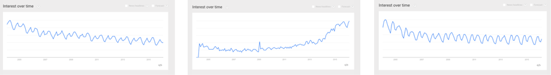
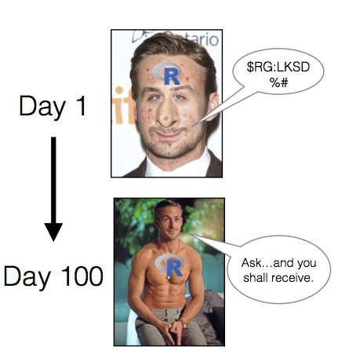
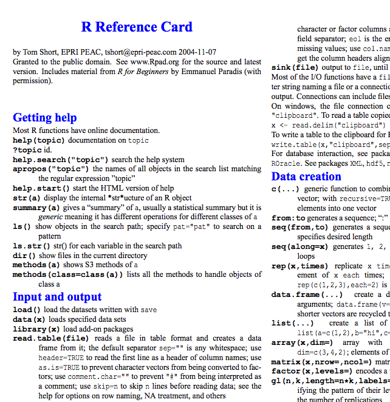

--- 
title: "YaRrr! The Pirate's Guide to R"
author: "Nathaniel D. Phillips"
date: "2017-02-27"
site: bookdown::bookdown_site
output: bookdown::gitbook
documentclass: book
bibliography: [book.bib, packages.bib]
biblio-style: apalike
link-citations: yes
github-repo: ndphillips/ThePiratesGuideToR
description: "An introductory book to R written by, and for, R pirates"
cover-image: images/YaRrr_Cover.jpg
url: 'https\://bookdown.org/ndphillips/YaRrr/'
---

# Preface {#intro}


The purpose of this book is to help you learn R from the ground-up. 

## Where did this book come from?

Let me make something very, very clear...

*I did not write this book*. 

This whole story started in the Summer of 2015. I was taking a late night swim on the Bodensee in Konstanz and saw a rusty object sticking out of the water. Upon digging it out, I realized it was an ancient usb-stick with the word YaRrr inscribed on the side. Intrigued, I brought it home and plugged it into my laptop. Inside the stick, I found a single pdf file written entirely in pirate-speak. After watching several pirate movies, I learned enough pirate-speak to begin translating the text to English. Sure enough, the book turned out to be an introduction to R called The Pirate's Guide to R.

This book clearly has both massive historical and pedagogical significance. Most importantly, it turns out that pirates were programming in R well before the earliest known advent of computers. Of slightly less significance is that the book has turned out to be a surprisingly up-to-date and approachable introductory text to R. For both of these reasons, I felt it was my duty to share the book with the world.

If you or spot any typos or errors, or have any recommendations for future versions of the book, please write me at YaRrr.Book\@gmail.com or tweet me \@YaRrrBook.

## Who is this book for?

While this book was originally written for pirates, I think that anyone who wants to learn R can benefit from this book. If you haven't had an introductory course in statistics, some of the later statistical concepts may be difficult, but I'll try my best to add brief descriptions of new topics when necessary. Likewise, if R is your first programming language, you'll likely find the first few chapters quite challenging as you learn the basics of programming. However, if R is your first programming language, that's totally fine as what you learn here will help you in learning other languages as well (if you choose to). Finally, while the techniques in this book apply to most data analysis problems, because my background is in experimental psychology I will cater the course to solving analysis problems commonly faced in psychological research.

**What this book is**

This book is meant to introduce you to the basic analytical tools in R, from basic coding and analyses, to data wrangling, plotting, and statistical inference.

**What this book is not**

This book does not cover any one topic in extensive detail. If you are interested in conducting analyses or creating plots not covered in the book, I'm sure you'll find the answer with a quick Google search!

## Why is R so great?

As you've already gotten this book, you probably already have some idea why R is so great. However, in order to help prevent you from giving up the first time you run into a programming wall, let me give you a few more reasons:

1. R is 100\% free and as a result, has a huge support community. Unlike SPSS, Matlab, Excel and JMP, R is, and always will be completely free. This doesn't just help your wallet - it means that a huge community of R programmers will constantly develop an distribute new R functionality and packages at a speed that leaves all those other packages in the dust! Unlike Fight Club, the first rule of R is "Do talk about R!" The size of the R programming community is staggering. If you ever have a question about how to implement something in R, a quick Poogle\footnote{I am in the process of creating Poogle - Google for Pirates. Kickstarter page coming soon...} search will lead you to your answer virtually every single time.

2. R is the presnt, and future of statistical programming. To illustrate this, look at the following three figures. These are Google trend searches for three terms: R Programming, Matlab, and SPSS. Try and guess which one is which.

<!-- -->

3. R is incredibly versatile. You can use R to do everything from calculating simple summary statistics, to performing complex simulations to creating gorgeous plots like the chord diagram on the right. If you can imagine an analytical task, you can almost certainly implement it in R.

4. Using RStudio, a program to help you write R code, You can easily and seamlessly combine R code, analyses, plots, and written text into elegant documents all in one place using Sweave (R and Latex) or RMarkdown. In fact, I translated this entire book (the text, formatting, plots, code...yes, everything) in RStudio using Sweave. With RStudio and Sweave, instead of trying to manage two or three programs, say Excel, Word and (sigh) SPSS, where you find yourself spending half your time copying, pasting and formatting data, images and test, you can do everything in one place so nothing gets misread, mistyped, or forgotten.


```r
circlize::chordDiagram(matrix(sample(10), 
                              nrow = 2, ncol = 5))
```

<div class="figure">

<p class="caption">(\#fig:unnamed-chunk-3)A super cool chord diagram from the circlize package</p>
</div>


5. Analyses conducted in R are transparent, easily shareable, and reproducible. If you ask an SPSS user how they conducted a specific analyses, they will either A) Not remember,  B) Try (nervously) to construct an analysis procedure on the spot that makes sense - which may or may not correspond to what they actually did months or years ago, or C) Ask you what you are doing in their house. I used to primarily use SPSS, so I speak from experience on this. If you ask an R user (who uses good programming techniques!) how they conducted an analysis, they should always be able to show you the exact code they used. Of course, this doesn't mean that they used the appropriate analysis or interpreted it correctly, but with all the original code, any problems should be completely transparent!

6. And most importantly of all, R is the programming language of choice for pirates.


## Why R is like a relationship... {#rrelationship}

Yes, R is very much like a relationship. Like relationships, there are two major truths to R programming:

<div class="figure" style="text-align: center">

<p class="caption">(\#fig:unnamed-chunk-4)Yep, R will become both your best friend and your worst nightmare. The bad times will make the good times oh so much sweeter.</p>
</div>

1. There is nothing more *frustrating* than when your code does *not* work

2. There is nothing more *satisfying* than when your code *does* work!


Anything worth doing, from losing weight to getting a degree, takes time. Learning R is no different. Especially if this is your first experience programming, you are going to experience a *lot* of headaches when you get started. You will run into error after error and pound your fists against the table screaming: "WHY ISN'T MY CODE WORKING?!?!? There must be something wrong with this stupid software!!!" You will spend hours trying to find a bug in your code, only to find that - frustratingly enough, you had had an extra space or missed a comma somewhere. You'll then wonder why you ever decided to learn R when (::sigh::) SPSS was so "nice and easy."


<div class="figure" style="text-align: center">

<p class="caption">(\#fig:unnamed-chunk-5)When you first meet R, it will look so fugly that you'll wonder if this is all some kind of sick joke. But trust me, once you learn how to talk to it, and clean it up a bit, all your friends will be crazy jealous.</p>
</div>

**Fun Fact!** SPSS stands for "Shitty Piece of Shitty Shit". True story.

This is perfectly normal! Don't get discouraged and DON'T GO BACK TO SPSS! That would be quitting on exercise altogether because you had a tough workout.

Trust me, as you gain more programming experience, you'll experience fewer and fewer bugs (though they'll never go away completely). Once you get over the initial barriers, you'll find yourself conducting analyses much, much faster than you ever did before.


## R resources


### R Cheatsheets

<div class="figure" style="text-align: center">

<p class="caption">(\#fig:rreferencecard)The R reference card written by Tom Short is absolutely indispensable!</p>
</div>

Over the course of this book, you will be learning *lots* of new functions. Wouldn't it be nice if someone created a Cheatsheet / Dictionary of many common R functions? Yes it would, and thankfully several friendly R programmers have done just that. Below is a table of some of them that I recommend. I highly encourage you to print these out and start highlighting functions as you learn them!

| CheatSheet| Link|
|:----------------------------|:--------|
|     R Basics by Tom Short|    [https://cran.r-project.org/doc/contrib/Short-refcard.pdf](https://cran.r-project.org/doc/contrib/Short-refcard.pdf)|
|     R Basics by Mhairi McNeill|    [http://github.com/rstudio/cheatsheets/raw/master/source/pdfs/base-r.pdf](http://github.com/rstudio/cheatsheets/raw/master/source/pdfs/base-r.pdf)|
|    Advanced R by Arianne Colton and Sean Chen|    [hhttps://www.rstudio.com/wp-content/uploads/2016/02/advancedR.pdf](https://www.rstudio.com/wp-content/uploads/2016/02/advancedR.pdf)|
|     Plotting|    [https://www.rstudio.com/wp-content/uploads/2016/10/how-big-is-your-graph.pdf](https://www.rstudio.com/wp-content/uploads/2016/10/how-big-is-your-graph.pdf)|


### Getting R help and inspiration online

Here are some great resources for R help and inspiration:

| Site| Description|
|:----------------------------|:-----------------------------------|
|     [www.google.com](http://www.google.com)| If you haven't heard of it, Google is this amazing site that gives you access to all R knowledge that has ever existed. Just ask it an R question and 99.9\% of the time it will give you the answer!|
|     [www.r-bloggers.com](http://www.r-bloggers.com)| R bloggers is my go-to place to discover the latest and greatest with R.|
|     [blog.revolutionanalytics.com](http://blog.revolutionanalytics.com)| Revolution analytics always has great R related material.|
|     [www.kaggle.com](http://www.kaggle.com)|Kaggle is a really cool website that posts data analysis challenges that anyone can try to solve. It also contains a wide range of real-world datasets and tutorials.|


### Other R books

There are many, many excellent (non-pirate) books on R, some of which are available online for free. Here are some that I highly recommend:

| Book| Description|
|:----------------------------|:-----------------------------------|
|     [R for Data Science by Garrett Grolemund and Hadley Wickham](http://r4ds.had.co.nz/)| The best book to learn the latest tools for elegantly doing data science.|
|     [The R Book by Michael Crawley](https://www.amazon.com/R-Book-Michael-J-Crawley/dp/0470973927/ref=sr_1_1?ie=UTF8&qid=1487759048&sr=8-1&keywords=the+r+book)| As close to an R bible as you can get.|
|     [Advanced R by Hadley Wickham](http://adv-r.had.co.nz/)|A truly advanced book for expert R users, especially those with a programming background. Hadley Wickham is *the* R guru.|
|     [Discovering Statistics with R by Field, Miles and Field](https://www.amazon.com/Discovering-Statistics-Using-Andy-Field/dp/1446200469/ref=sr_1_2?ie=UTF8&qid=1487759316&sr=8-2&keywords=statistics+with+r)| A classic text focusing on the theory and practice of statistical analysis with R|
|     [Applied Predictive Modeling by Kuhn and Johnson](https://www.amazon.com/Applied-Predictive-Modeling-Max-Kuhn/dp/1461468485/ref=sr_1_1?ie=UTF8&qid=1487759459&sr=8-1&keywords=applied+predictive+modeling)| A great text specializing in statistical learning aka predictive modeling aka machine learning with R.|


## Who am I?

<div class="figure" style="text-align: center">

<p class="caption">(\#fig:unnamed-chunk-6)Like a pirate, I work best with a mug of beer within arms' reach.</p>
</div>

My name is Nathaniel -- not Nathan...not Nate...and *definitely* not Nat. I am a psychologist with a background in statistics and judgment and decision making. You can find my R (and non-R) related musings at [http://ndphillips.github.io](http://ndphillips.github.io)

### Acknowledgements

I am deeply indebted to many people for either directly or indirectly helping me make this book happen. I would especially like to thank [Captain Thomas Moore](https://www.grinnell.edu/users/mooret) and [Captain Wei Linn](http://www.math.ohiou.edu/people/directory/linwei) for my early training in both statistics and R, [Captain Hansjoerg Neth](https://www.spds.uni-konstanz.de/hans-neth) for teaching me LaTeX and ultimately inspiring me to write (I mean translate) this book, and [Captain Dirk Wulff](https://psycho.unibas.ch/fakultaet/personen/profil/person/wulff/) for teaching me almost everything I know about R. If I hadn't been lucky enough to meet just one of these people, this book would not exist.


## Please Contribute!

I am grateful for comments, questions, bug reports, and requests to future editions of the book! If there's anything you'd like to add or share, please contact me via email at yarrr.book@gmail.com, or if you are familiar with GitHub, post an issue at  [https://github.com/ndphillips/ThePiratesGuideToR/issues](https://github.com/ndphillips/ThePiratesGuideToR/issues). 


